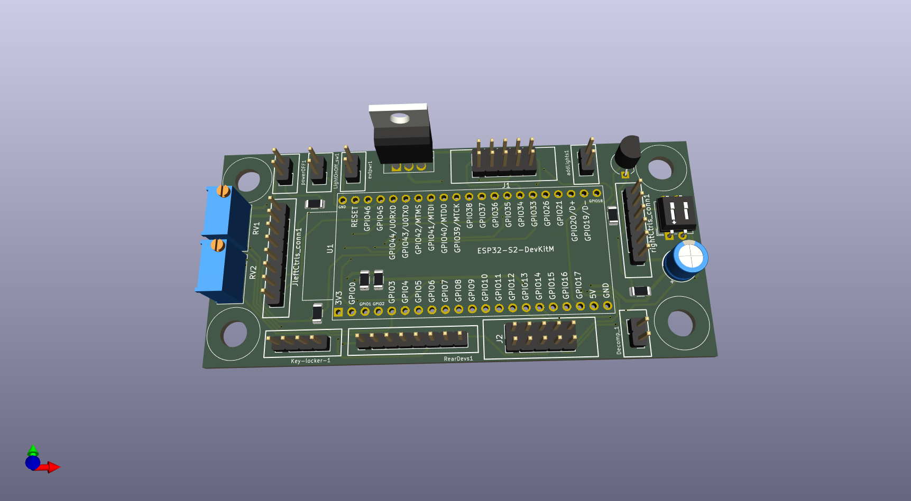
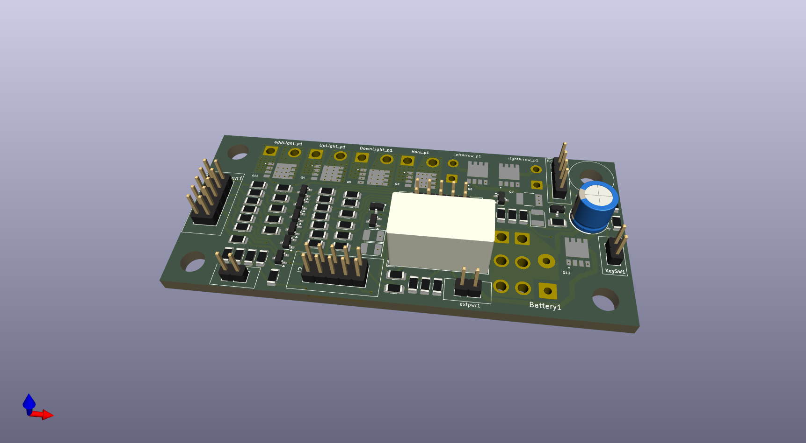

## 1.0 Files

|       Files/Directories        | Description                          |
|--------------------------------|--------------------------------------|
| Connectors.txt                 | Cables's connectors pin-out          |
| create_fabric_files.sh         | Script to create the fabric files    |
| kicad_symbols                  | Non standard KiCAD symbols libraries |
| LICENSE.txt                    | The project's licence file (\*)      |
| pcb-a                          | Controller stage's PCB               |
| pcb-b                          | Front side power stage's PCB         |
| pcb-c                          | Rear side power stage's PCB          |
| starter_key_plug               | The schema of the resistive key      |
| images                         | The images used by this file         |

(*) This project is covered by the GPL-3. Please, read that file for further information

## 2.0 Description:
This folder contains all files you need to get and/or modify your own PCBs.
To perform these actions you need to install [KiCAD](https://www.kicad.org) software (ver >= 9.0), a free software suite for
electronic design automation (EDA).

The solution implemented in this branch (ESP32__dualPCB) is composed by three PCBs. The following table shows you their functions
and the connected devices

|         Function         |                                  Devices                                       |
|--------------------------|--------------------------------------------------------------------------------|
| Logic controller         | input buttons, switches... from hand bar and motorbike internals (eg. neutral) |
| Front side power stage   | front side services (eg. horn, front-lights, front-direction-indicators..)     |
| Rear side power stage    | rear side service (eg. stop-light, start-engine relay, rear-light...)          |

For further information about any single PCB, please, read the proper README.md file inside its folder

The following images shows you the PCB shapes they should be at the end

