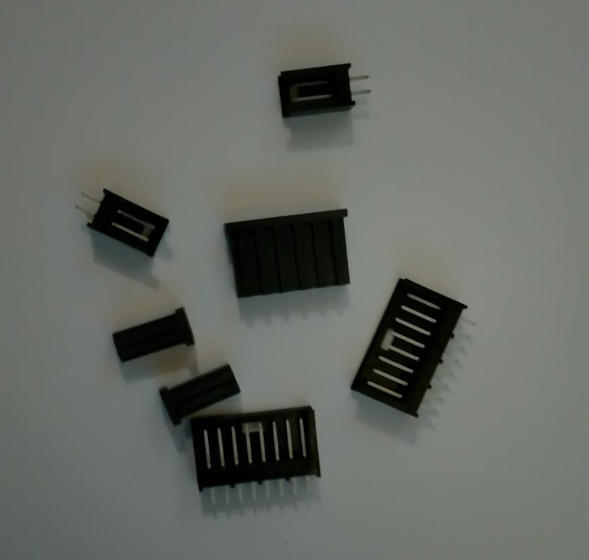

## 1.0 Files

|        Files/Directories       | Description                          |
|--------------------------------|--------------------------------------|
| pcb-a.kicad_sch                | Main electrical schematic            |
| mbes_pcbA_connectors.kicad_sch | Connectors electrical schematic      |
| pcb-a.kicad_pcb                | PCB                                  |

(*) This project is covered by the GPL-3. Please read that file for further information.

## 2.0 Description
This folder contains all the files you need to modify/build the PCB that implements the Motorbike Electrical System's brain. It
controls the handlebar commands (buttons, switches...) and turns on/off the services according to its policies.

### 2.1 The Microcontroller Unit
In order to implement the motorbike's services management, I have chosen the 
[ESP32-S2](https://documentation.espressif.com/esp32-s2_datasheet_en.pdf) MCU produced by Espressif. I selected this chip for the
following reasons:

- It has **43 programmable GPIOs**. This allows me to manage all I/O lines without an external bus expander (e.g. MCP23016). 
- Its core is an Xtensa® **single-core 32-bit LX7 microprocessor (240 MHz)**. It is faster than what is needed.
- ROM = 128 KB and **SRAM = 320 KB**. Adequate also for future implementations (e.g. display management).
- I2C and SPI ports. They will be necessary for future **CAN bus** implementation.
- **ESP-IDF** framework. It is a large and powerful framework that allows you to develop even complex firmware easily.
- Embedded **Wi-Fi** support. It will be needed for future implementations (mobile cockpit).
- **ADC**. Required for resistive key authentication.
- It is a powerful but cheap device: less than 4 euros.

### 2.2 MCU vs DevKit
The ESP32-S2, like all modern MCUs, is available in SMD but not in a THT package. Unfortunately, its SMD package (like most modern
MCUs) is difficult to solder, too difficult for me. So, for now, I have used the official development kit 
[ESP32-S2-DevKitM-1](https://docs.espressif.com/projects/esp-idf/en/v5.2.1/esp32s2/hw-reference/esp32s2/user-guide-devkitm-1-v1.html)
produced by Espressif. It is widely available on the market and costs less than 10 euros.

### 2.3 Cables and internal connectors
For every cable starting from this PCB, a 2.54mm pin header socket is provided. This type of connector can support up to 2.5A of
current. This means it can handle 1.5A without problems, which is absolutely higher than what is needed here.  
On the PCB you can find the following sockets:

1) Two [10-pin dual-row connectors](https://www.molex.com/en-us/products/part-detail/702461004?display=pdf) used for communication
   between the two PCBs on the motorbike's front side.
2) Two single-row connectors used to connect the left and right handlebar controls (lights, direction indicators, horn,
   engine on/off...).
3) One 8-pin single-row connector to control the rear-side power stage (pcb-c).
4) Many 2-pin single-row connectors to connect some switches (PowerOff, additionalLight, decompressor...).
5) One 4-pin single-row connector for the resistive key socket (4 of 6 pins).

Unfortunately, I have not found documentation for 2.54 mm single-row pin headers, so I took the following photo:

The cables connected to the **#1** type socket are for internal communication only, and the current flowing through them is very low (<100 mA).  
Thanks to this, you don't need to solder the connector pins; you can use a 
[10-pin flat cable](https://www.we-online.com/components/products/datasheet/63911015521CAB.pdf) and
the [YTH214 Crimping Tool IDC](https://docs.rs-online.com/8d29/A700000009783991.pdf) to crimp the connectors.

All other connectors (except the one for the resistive key lock) are for external links, so the cable must be sufficiently robust.  
For this reason, you can use AWG24 cable: it has a 0.22 mm² cross-section and supports up to 2 A, much more than needed.

### 2.4 External connectors
In order to connect the handlebar electrical controls (buttons/switches), I selected 2.8 mm tab terminal system connectors.  
These connectors are widely used in automotive applications; for this reason, you can find them referred to as "2.8 mm automotive connectors".  
You can easily buy them as kits, even on Amazon.  
Each (2.8 mm) pin of this type can handle 10 A without problems.

	      +---+
	+-----+---+-----+
	| +-+  +-+  +-+ |
	| |4|  |5|  |6| |
	| +-+  +-+  +-+ |
	| +-+  +-+  +-+ |
	| |1|  |2|  |3| |
	| +-+  +-+  +-+ |
	+---------------+

**Left connector pin map:**

1) GND
2) Left turn indicator
3) Low-beam light
4) High-beam light
5) Right turn indicator
6) Horn
	                              
**Right connector pin map:**

1) GND
2) GND
3) Brake control switch
4) Engine START button
5) Engine OFF
6) Engine ON
