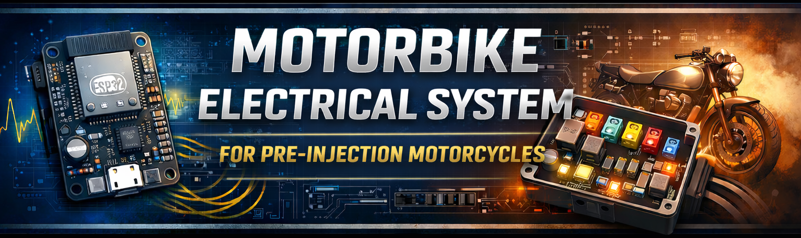

## 1.0 Files

|       Files/Directories      | Description                          |
|------------------------------|--------------------------------------|
| pcb-b.kicad_sch              | Main electric scheme                 |
| mbes_front_outputs.kicad_sch | Output lines electric scheme         |
| pcb-b.kicad_pcb              | PCB                                  |

(*) This project is covered by the GPL-3. Please read that file for further information.

## 2.0 Description:
This folder contains all files you need to modify/build the PCB that implements the power stage for the motorbike front-side
connected devices (e.g. low-beam light, high-beam light, direction indicators, horn...). This PCB also provides the following features:

- It locks the engine when the vehicle is turned off, using CDI
- It provides temporary electric current to the controller's MCU for key authentication
- It provides electric current when the key has been authenticated

### 2.1 Power stage
In order to provide electric current to the motorbike's devices (lights, horn...), I have used the
[TPCA8120](https://static.chipdip.ru/lib/624/DOC060624975.pdf) P-Channel MOS. Its low drain-source on-resistance (4mOhm) allows this 
electronic circuit to avoid wasting electric power with high current too. For example, with a 60W (5A) light, it wastes just 20mW!!
It can also support 10A current and it is very small. But, at the moment, the whole  PCB is planed for lower current. The following table
shows the common devices and their max and expected needed current. The expected values have been measured on my Suzuki DR350
with LED lights.

| Device           | Expected current | Max current |
|------------------|------------------|-------------|
| low-beam light   | 200mA  (2.4W)    | 500mA (6W)  |
| high beam-light  | 2A     (24W)     | 6A    (72W) |
| dir-indicator    | <100mA (1.2W)    | 500mA (6W)  |
| horn             | 2A     (24W)     | 6A    (72W) |
| additinal light  | 2A     (24W)     | 6A    (72W) |

### 2.2 Fuses
To reduce the number of external fuses, all devices that require less than 6W use 
[MSMF050](https://www.bourns.com/docs/product-datasheets/mf-msmf.pdf) PTC resettable fuses.
As you can see in the component's datasheet, it can handle up to 500mA current and stop currents over 1A.
With this solution, only 3 external (5A) fuses are needed, plus the (20A) general one.

### 2.3 Engine locking mechanism
As in all motorbikes, in order to avoid that the engine can be started when the motorbike is locked, the proper CDI pin must be
connected to GND. To achieve this result and to protect the circuit from unknown electric voltage from the CDI, I have 
used the relay [HK19-DC12V](https://grobotronics.com/images/datasheets/HK19F-12V.pdf) instead of a modern N-Channel MOS.

In order to manage the concurrency events of the power-off button and the engine electronic management, I have used the
[PMEG40T30ER](https://assets.nexperia.com/documents/data-sheet/PMEG40T30ER.pdf) low Trench MEGA Schottky barrier rectifier.

### 2.4 Cables and internal connectors
In order to connect this power stage with the master controller PCB, two
[10-pin dual-row connectors](https://www.molex.com/en-us/products/part-detail/702461004?display=pdf) have been used. For
further details, read the PCB-a documentation.

For the cables to the electric consumers (e.g. lights, horn...), you can use **AWG18 cable**. It is thin enough but can handle
**6A** electric current without problems. You can use the same cable also for the electric wire connected to the fuses.
