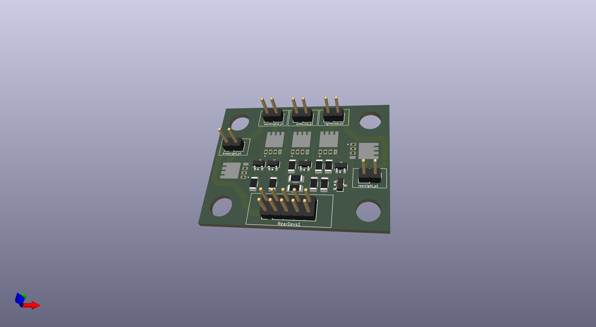
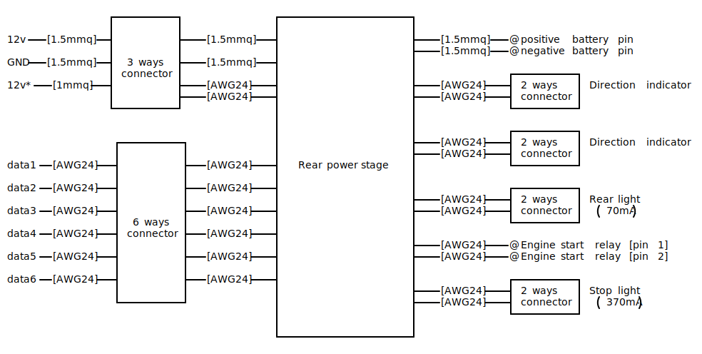

## 1.0 Files

| Files/Directories | Description                 |
|-------------------|-----------------------------|
| pcb-c.kicad_sch   | Electric symbolic scheme    |
| pcb-c.kicad_pcb   | PCB                         |

(*) This project is covered by the GPL-3. Please, read that file for further information

## 2.0 Description:
This folder contains all files you need to build and/or modify the PCB placed in the rear side of the (DR350) motorbike.
This circuit is a small power stage for the rear light indicators, stop light, and position light. Because all lights
are available in LED format, the power stage is set to provide maximum 500mA (6W) per device.

## 2.1 Internals:
In order to fit this device in the DR350 rear size, I have tried to reduce the required space as much as possible. Also
for this reason, normal fuses have been replaced by [MSMF050](https://www.bourns.com/docs/product-datasheets/mf-msmf.pdf)
PTC Resettable Fuses.

All the power stage's outputs are equivalent but one is dedicated to the motorbike's starter relay. This relay type can
be a big one, often. So, a fly-back diode is very important. For this reason I have used a 
[M7 Rectifiers Diode](https://diotec.com/request/datasheet/m1.pdf).

## 3.0 Devices building:
The following images shows you the PCB shape it should be at the end

## 4.0 Connections

