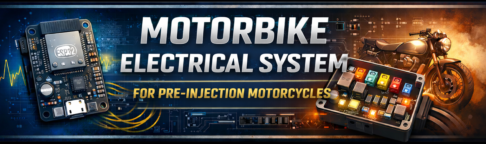
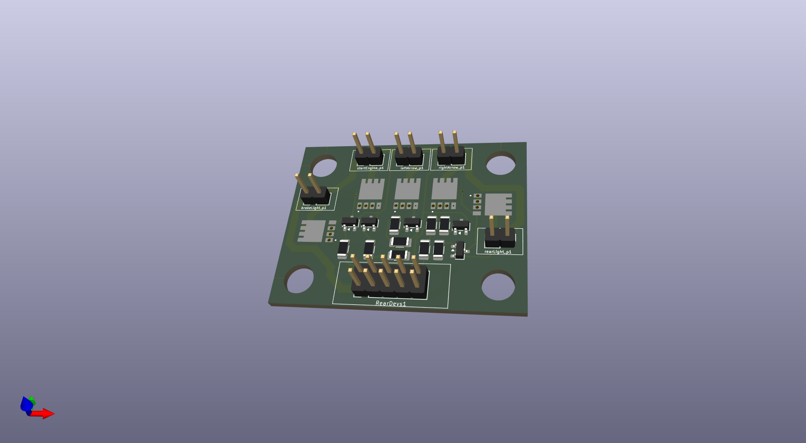
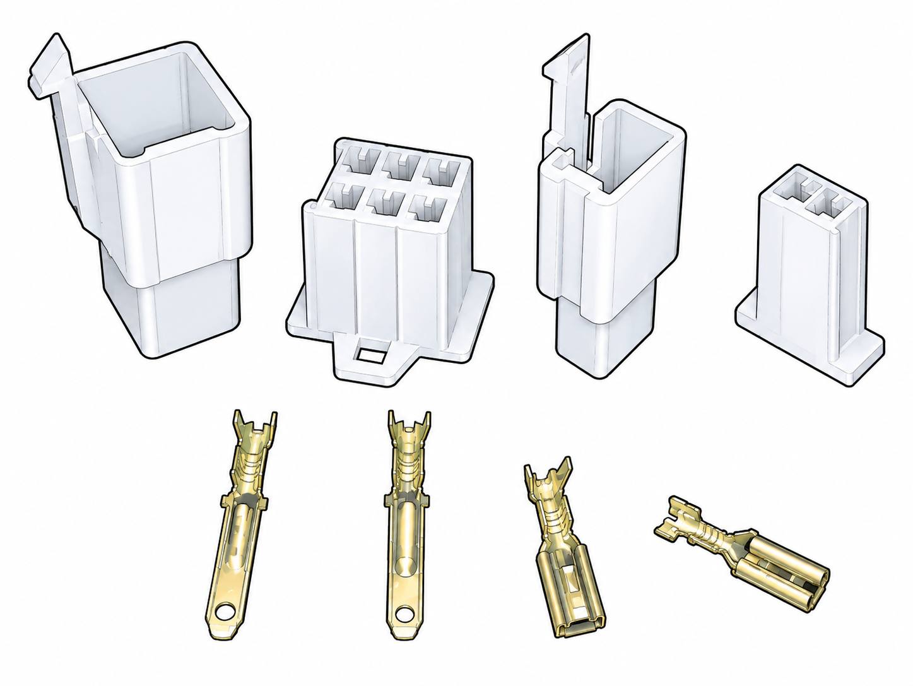

## 1.0 Files

| Files/Directories | Description             |
|-------------------|-------------------------|
| pcb-c.kicad_sch   | Electrical schematic    |
| pcb-c.kicad_pcb   | PCB                     |

(*) This project is covered by the GPL-3. Please, read that file for further information

## 2.0 Description:
This folder contains all files you need to build and/or modify the PCB placed in the rear side of the (DR350) motorbike.
This circuit is a small power stage for the rear turn indicators, brake light, and position light. Because all lights
are available in LED format, the power stage is set to provide maximum 500mA (6W) per device.

## 2.1 Internals:
In order to fit this device in the DR350 rear size, I have tried to reduce the required space as much as possible. Also
for this reason, normal fuses have been replaced by [MSMF050](https://www.bourns.com/docs/product-datasheets/mf-msmf.pdf)
PTC Resettable Fuses.

All the power stage's outputs are equivalent but one is dedicated to the motorbike's starter relay. This relay type can
be a big one, often. So, a fly-back diode is very important. For this reason I have used a 
[M7 Rectifiers Diode](https://diotec.com/request/datasheet/m1.pdf).

## 3.0 PCB Layout
The following images shows you the PCB shape it should be at the end

## 4.0 Connections
The following scheme shows you how to build the cables to connect the PCB to the other motorbike components.

In the left side of the scheme you can see the cables you have to connect with the PCB (pcb-b) in the front side of the
motorcycle. The 3-ways cable of them is used to provide the battery energy to main controller device (in the front-side),
for this reason the selected connector is a 
[Receptacle Terminal Housing, 3 Position, 6.3 mm](https://www.te.com/en/product-180941.html) one. The selected FASTON terminals
can support currents up to 25A

The 6 ways cable, in the scheme left side, has to communicate data from the controller device to the rear power stage.
It has to support a very low current. So, I selected a
[2.8mm (.110") series connectors](https://www.corsa-technic.com/item.php?item_id=222&category_id=53&manufacturer_id=44).
They are very common in automotive applications, you can find all the series producted by other vendors. To get a clear
idea of them I post here a drawing of the cables.

