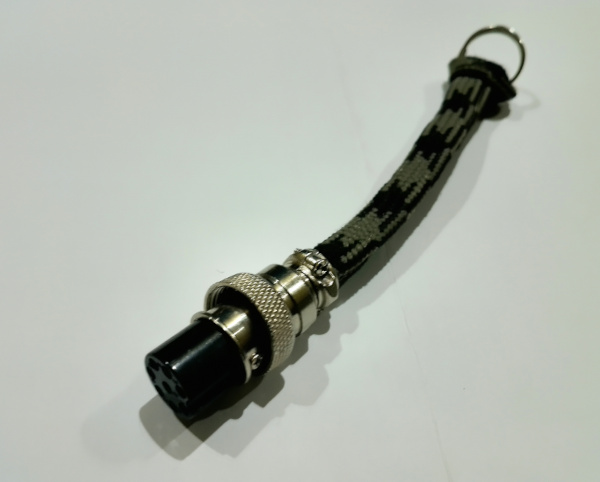

## 1.0 Files

|      Files/Directories     |                 Description                  |
|----------------------------|----------------------------------------------|
| starter_key_plug.kicad_sch | The electric diagram of the motorcycle's key |

(*) This project is covered by the GPL-3. Please read that file for further information.

## 2.0 Description
This folder contains all informations and diagrams you need to build your own motorbike's key.
The key is composed by a [GX series](https://www.shoptronica.com/ficheros/GX-Series-Aviation-Connectors.pdf) 8-pin connector
and two resistors connected as the electric-diagram shows you.

At the end you should obtain an object similar to the one you can see on the photo

