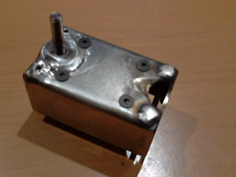
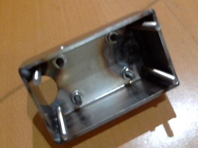
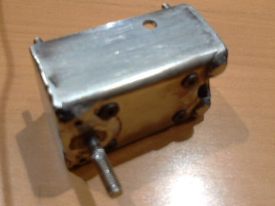

> Modular electrical control unit for pre-injection motorbikes  
> based on ESP32 and distributed power management

## 1.0 Files

|            Files/Dirs                     |                 Description                  |
|-------------------------------------------|----------------------------------------------|
| electricSystemBox.dxf                     | The box that will contain the PCB-C          |

## 2.0 Description:
The CAD drawings in this folder describe a custom-shaped box for PCB-C designed for a Suzuki DR350 motorcycle.
The "electricSystemBox.dxf" file contains two 2D parts that they must be realized starting from a 2mm steel metal sheet.
The larger part must be bent where the "bend" layer lines indicate.

### 2.1 Welding
To complete the box, consider the following steps:

1) weld the walls you folded
2) weld a 6MA (l=30mm) screw head from the internal side of the box. It will link the box to the motorbyke framework
3) weld the heads of four 4MA (l=45mm) screws in the external holes, these screws will allow you to close the box's lid

[!] All welded screws should be steel metal ones

### Motorbike framework modification
In order to lock the box on the framework you have to modify the DR350's framework performing the following steps:

- Use a drill on the lower threaded hole used to lock the battery support. You have to turn it in a through hole.
- Remove the original fuse support. It is attached with a single spot weld, so, you can remove it with pilers.
  Remove any metal parts still attached to the frame with a rotary tool

